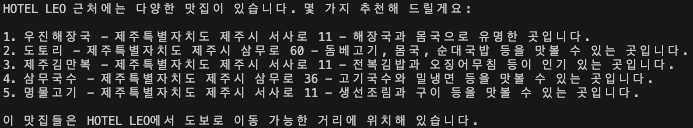

# fine-tune 테스트

- 실행순서
- [DataSet](https://www.bigdata-culture.kr/bigdata/user/data_market/detail.do?id=5c294ba0-7f9c-11ee-88b4-1384e6e2c3c9) 다운로드 후 jeju_datasets 디렉토리로 이동
- `python data_preprocessing.py`
- `python training.py`
- `python inference.py`

## Training

- fine-tune에 사용하기 적절한 데이터 인지는 모르겠지만 테스트 용도로 아래 데이터 사용하였습니다.

- 사용된 Credit: $0.87 USD 
    - Quantity: 1.734
    - Unit Price: $0.50 USD
    - Total: $0.87

## Result

- trainset에 있던걸 물어봤는데 없던걸 대답해준 이유는,,,?
    - 아마 적합하지않은 데이터셋이어서(RAG로 처리하는게 나을지도!) 일수도 있고 epochs이 부족해서 충분히 tune되지 않았을수도 있을것 같습니다.